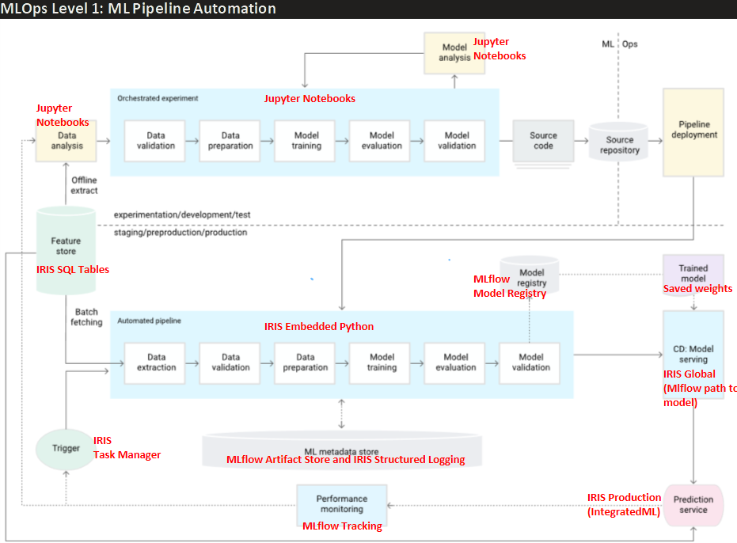
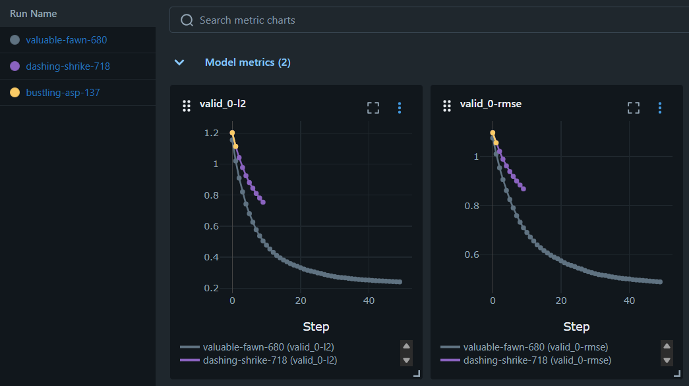

# Continuous Training (CT) in IRIS

This repo contains a solid base for Machine Learning Pipeline Automation as part of a proper MLOps (as the Google's standard defined in https://docs.cloud.google.com/architecture/mlops-continuous-delivery-and-automation-pipelines-in-machine-learning?hl=en) using the IRIS native components shown in the following graph:




In a nutshell this repo proposes MLflow for the Data Science experimentation phase (upper section), running locally (server can be later deployed for team working) using MLflow, and the rest of CT's automated pipeline using native IRIS tools. Below we explain the most relevant bits of how these components work and how to test them.


The only configuration needed was designed by only running

```
docker-compose up --build -d
```

The Docker Compose setup creates:

An IRIS container responsible for data management and application processes. A separate MLflow stack (MLflow server, Postgres, and MinIO) dedicated to experiment tracking and UI-based monitoring for Data Science projects.All MLflow-related state (metadata and artifacts such as models and metrics) is stored in the durable host-mounted directory dur/sandbox/mlflow.,Because this directory resides in the host filesystem and is bind-mounted, its contents persist across container restarts and are accessible outside the containers.


WARNING: a .env is in this project uploaded for testing purposes, but it should be added to the .gitignore to avoid sharing credentials in a production environment

If during build, any of the container components for mlflow fail, retry commenting out all services except "iris" to create only the iris container through "docker-compose up --build -d" and manually start server (http://localhost:5000) in the desired folder by running 

```
mlflow server --port 5000
```

then you can Open http://localhost:5000 in your browser to view the UI.

## Experimentation framework (MLflow Tracking)

MLflow Tracking is the component of MLflow for data scientists who train traditional machine learning models. It keeps track of model performance metrics, saves weights in a standard manner, logs hyperparameters, and much more. All this information is saved locally (in this repo), and dashboards, metrics and all info related to the model development of interest for data scientists can be easily consulted just by going to http://localhost:5000 in any web explorer.

Codewise only a couple of additional lines of code are added to the python script or jupyter notebook to link training progress to be stored in this platform.

Example: 

In this example we only require 2 additional lines (besides import mlflow of course) to keep track of the experimentations for my LightGbm model over one popular sklearn's public dataset:

```python
import os
import dotenv
import pandas as pd
from sklearn import datasets
from sklearn.model_selection import train_test_split
from sklearn.metrics import r2_score

import lightgbm as lgb
import mlflow
import mlflow.lightgbm

dotenv.load_dotenv()

mlflow.set_tracking_uri(os.environ["MLFLOW_TRACKING_URI"])
mlflow.set_experiment("MyLightGMB-experimentation") # 1: name of the experiment to identify in the UI

X, y = datasets.fetch_california_housing(return_X_y=True)
X_train, X_test, y_train, y_test = train_test_split(
    X, y, test_size=0.2, random_state=42
)
params = {
    "n_estimators": 20,
    "learning_rate": 0.1,
    "max_depth": 50,
    "random_state": 42,
}
mlflow.lightgbm.autolog() # 2: Enable LightGBM autologging (would change for other libraries)

model = lgb.LGBMRegressor(**params)
model.fit(X_train, y_train, eval_set=[(X_test, y_test)], eval_metric="rmse")

```

And just like that we have full traceability of all the experiments we carry on. See below a short execise varying the number of extimators and max depth to reduce the rmse


Clicking each experiment, we can see more details, such as the training curve



Quickstart for Data Scientists: https://mlflow.org/docs/latest/ml/getting-started/quickstart/

Guide for automatic hyperparameter optimization using optuna, and mlflow for tracking: https://mlflow.org/docs/latest/ml/getting-started/hyperparameter-tuning/

Run python dur\sandbox\test_train.py to train and see performance tracking, and dur\sandbox\test_load.py to know how to load the resulting model based on the Run ID from the experiment desired (TODO: see why it takes so long).


## Logging
This repo uses Structured Logging to log every relevant aspect of the operational health of the CT pipeline. The configuration set on the iris_autoconf.sh file to keep for the "INFO" level, only "Utility.Event" events creates with the form

do ##class(%SYS.System).WriteToConsoleLog(message, prefix, severity)

e.g:
    do ##class(%SYS.System).WriteToConsoleLog("This is my INFO CT Log", 0, 0)
    do ##class(%SYS.System).WriteToConsoleLog("This is my WARNING CT Log", 0, 1)
    do ##class(%SYS.System).WriteToConsoleLog("This is my SEVERE CT Log", 0, 2)

This logging system is used throughout the whole pipeline for auditing purposes.


docker exec -it iris-experimentation iris terminal iris