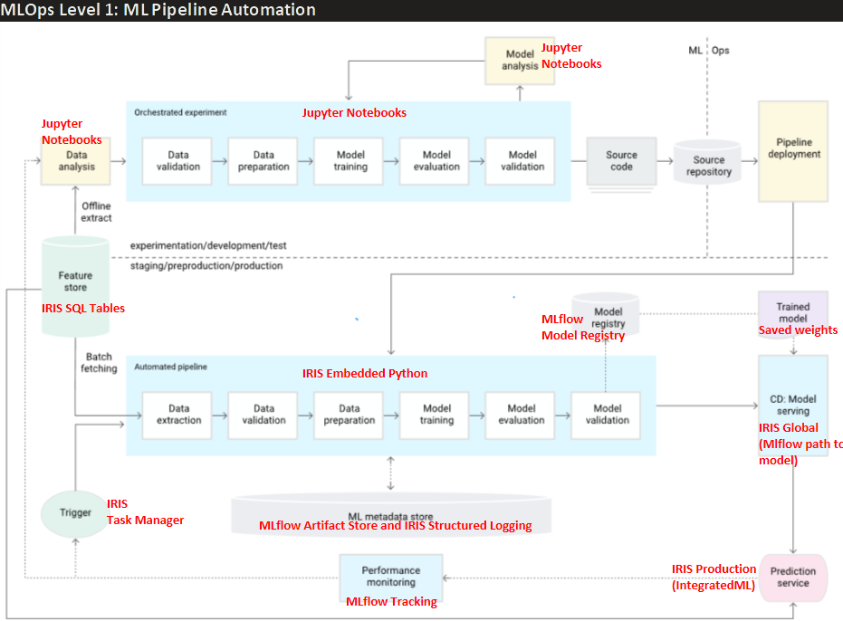
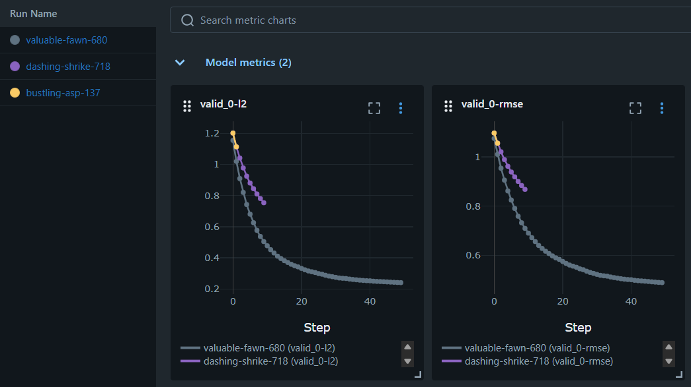
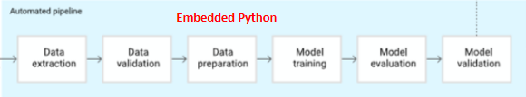

# Continuous Training (CT) in IRIS

This repo contains a solid base for Machine Learning Pipeline Automation as part of a proper MLOps (as the Google's standard defined in https://docs.cloud.google.com/architecture/mlops-continuous-delivery-and-automation-pipelines-in-machine-learning?hl=en) using the IRIS native components shown in the following graph:




In a nutshell this repo proposes MLflow for the Data Science experimentation phase (upper section), running locally (server can be later deployed for team working) using MLflow, and the rest of CT's automated pipeline using native IRIS tools. Below we explain the most relevant bits of how these components work and how to test them.


The only configuration needed was designed by only running

```
docker-compose up --build -d
```

The Docker Compose setup creates:

An IRIS container responsible for data management and application processes. A separate MLflow stack (MLflow server, Postgres, and MinIO) dedicated to experiment tracking and UI-based monitoring for Data Science projects.All MLflow-related state (metadata and artifacts such as models and metrics) is stored in the durable host-mounted directory dur/sandbox/mlflow.,Because this directory resides in the host filesystem and is bind-mounted, its contents persist across container restarts and are accessible outside the containers.


WARNING: a .env is in this project uploaded for testing purposes, but it should be added to the .gitignore to avoid sharing credentials in a production environment

If during build, any of the container components for mlflow fail, retry commenting out all services except "iris" to create only the iris container through "docker-compose up --build -d" and manually start server (http://localhost:5000) in the desired folder by running 

```
mlflow server --port 5000
```

then you can Open http://localhost:5000 in your browser to view the UI.

## Experimentation framework (MLflow Tracking)

MLflow Tracking is the component of MLflow for data scientists who train traditional machine learning models. It keeps track of model performance metrics, saves weights in a standard manner, logs hyperparameters, and much more. All this information is saved locally (in this repo), and dashboards, metrics and all info related to the model development of interest for data scientists can be easily consulted just by going to http://localhost:5000 in any web explorer.

Codewise only a couple of additional lines of code are added to the python script or jupyter notebook to link training progress to be stored in this platform.

Example: 

In this example we only require 2 additional lines (besides import mlflow of course) to keep track of the experimentations for my LightGbm model over one popular sklearn's public dataset:

```python
import os
import dotenv
import pandas as pd
from sklearn import datasets
from sklearn.model_selection import train_test_split
from sklearn.metrics import r2_score

import lightgbm as lgb
import mlflow
import mlflow.lightgbm

dotenv.load_dotenv()

mlflow.set_tracking_uri(os.environ["MLFLOW_TRACKING_URI"])
mlflow.set_experiment("MyLightGMB-experimentation") # 1: name of the experiment to identify in the UI

X, y = datasets.fetch_california_housing(return_X_y=True)
X_train, X_test, y_train, y_test = train_test_split(
    X, y, test_size=0.2, random_state=42
)
params = {
    "n_estimators": 20,
    "learning_rate": 0.1,
    "max_depth": 50,
    "random_state": 42,
}
mlflow.lightgbm.autolog() # 2: Enable LightGBM autologging (would change for other libraries)

model = lgb.LGBMRegressor(**params)
model.fit(X_train, y_train, eval_set=[(X_test, y_test)], eval_metric="rmse")

```

And just like that we have full traceability of all the experiments we carry on. See below a short execise varying the number of extimators and max depth to reduce the rmse


Clicking each experiment, we can see more details, such as the training curve



Quickstart for Data Scientists: https://mlflow.org/docs/latest/ml/getting-started/quickstart/

Guide for automatic hyperparameter optimization using optuna, and mlflow for tracking: https://mlflow.org/docs/latest/ml/getting-started/hyperparameter-tuning/

Run python dur\sandbox\test_train.py to train and see performance tracking, and dur\sandbox\test_load.py to know how to load the resulting model based on the Run ID from the experiment desired (TODO: see why it takes so long).


## Logging
This repo uses Structured Logging (https://docs.intersystems.com/irislatest/csp/docbook/DocBook.UI.Page.cls?KEY=GCM_structuredlog) to log every relevant aspect of the operational health of the CT pipeline. The configuration set on the iris_autoconf.sh file to keep for the "INFO" level, only "Utility.Event" events creates with the form

do ##class(%SYS.System).WriteToConsoleLog(message, prefix, severity)

e.g:
    do ##class(%SYS.System).WriteToConsoleLog("This is my INFO CT Log", 0, 0)
    do ##class(%SYS.System).WriteToConsoleLog("This is my WARNING CT Log", 0, 1)
    do ##class(%SYS.System).WriteToConsoleLog("This is my SEVERE CT Log", 0, 2)

This logging system is used throughout the whole pipeline for auditing purposes, and though all these logs can be seen in the managemente portal at System Operation > System Logs > Messages Log, the configuration done during the docker build, lets us have a persistent version at /dur/log/MLpipelineLogs.log, observable outside of the container, and in  JSON format for compatibility and any time analysis.

## Feature Store

All data for experimentation and for the CT pipeline is extracted from here.

Feature store is the single source of data and where every constant Parameter for the project is defined (e.g. each cliend might define readmission after 15, 30 or more days. Late arrival might be consideret arriving after 5, 10, or 20 minutes). These definitions are only related to the data itself, no hyperparameters are defined here, as they relate to the ML pipeline

In this repo we include the required methods for querying from DB, and Parameterts (unchangeable at runtime) are set in stone here.

## Automated Pipeline

The automated pipeline is the formal implementation of the data processing and model training performed during experimentation. This block consists of modular and clearly defined steps executed sequentially, implemented in the AutomatedPipeline class within the MLpipeline package — one method per step, all orchestrated by RunPipeline. These steps are described in detail below:



1) Data Extraction:
Leverages the FeatureStore to query the PointSamples table filtered by a datetime threshold using IRIS SQL, and converts the resulting %SYS.Python.SQLResultSet into a pandas DataFrame.
 - In: datetime filter string
 - Process: SQL query via FeatureStore
 - Out: DataFrame

2) Data Validation:
Inspects the DataFrame for data quality issues and logs warnings to the IRIS console: missing values, missing essential columns (x, y), incorrect data types, and IQR-based outlier detection. The DataFrame is passed through unchanged.
 - In: DataFrame
 - Process: Missing values, column, type and outlier checks
 - Out: DataFrame

3) Data Preparation:
Applies any non-learned transformations (renames, type casting — no .fit() calls), then splits the data into train and test sets using train_test_split with configurable TESTSIZE and SEED.
 - In: DataFrame
 - Process: Non-learned transforms + train/test split
 - Out: Xtrain, Ytrain, Xtest, Ytest

4) Model Training:
Builds a sklearn Pipeline with StandardScaler and LinearRegression, trains it on the training split, and logs the run to MLflow via autolog. Saves model artifacts to MODELSPATH, logs train_mae and train_r2, and tags the run with TrainingStatus: OK.
 - In: Xtrain, Ytrain, model params
 - Process: sklearn Pipeline fit + MLflow logging
 - Out: trained model

5) Model Evaluation:
Runs inference on the test split and logs val_mae and val_r2 to the same MLflow run. Tags the run with EvaluationStatus: OK and returns the metrics dictionary.
 - In: trained model, Xtest, Ytest
 - Process: inference + metric computation
 - Out: metrics dict

6) Model Validation:
Queries MLflow for the most recent prior run tagged with both TrainingStatus: OK and EvaluationStatus: OK, re-evaluates that model on the current test set for a fair comparison, and returns the run_id of the best performing model based on MAE and R2.

 - In: new model metrics, Xtest, Ytest
 - Process: load previous model + re-evaluate on current test set
 - Out: run_id of best model


Automatic Pipeline Flow:


Trigger: Manual (can be on new data, or on a schedule, or on model degradation, etc)


docker exec -it iris-experimentation iris terminal iris